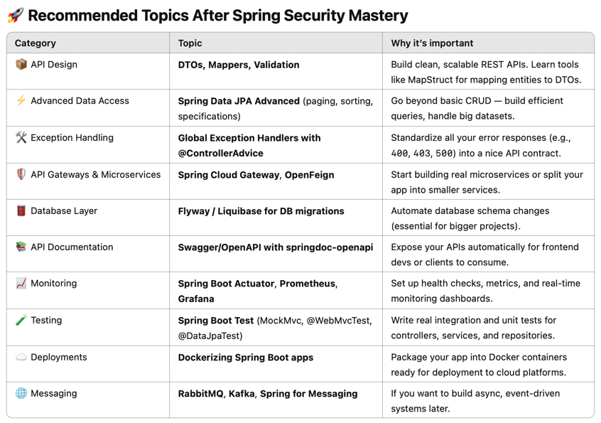

# Spring Boot Guide
This guide walks you through building a REST API using Spring Boot with components like Controllers, Services, Repositories, DTOs, Entities, Mappers, Exception Handlers, and Architecture patterns.

Spring Boot simplifies API development by providing embedded Tomcat web server and default configuration provide by its dependencies.

## Examples
Following github repositories offer implementation of microservices using Spring Boot.

### [Spring Boot Microservices by AlexPeti](https://github.com/AlexPeti/spring-boot-microservices)
This project demonstrates a microservices architecture using Spring Boot 3.2.4 and Java 17. It includes:
- Eureka Naming Server - For service discovery
- Spring Cloud Config Server - For centralized configuration management
- API Gateway Service - Handles routing and implements filters to ensure only authenticated users with valid JWTs access protected endpoints
- Identity Service - Manages registration, authentication, and JWT issuance and validation
- Demo Controller Microservice - A test endpoint to evaluate the effectiveness of the Gateway Service

### [Spring Boot Microservices by nihadamirov](https://github.com/nihadamirov/spring-boot-microservices)
This repository offers a set of microservices built with Spring Boot, featuring:
- Eureka Server - For service discovery and registration
- API Gateway (Zuul) - Manages routing and load balancing for incoming requests to various microservices
- Order Service - Manages order-related operations
- Product Service - Handles product-related operations
- Customer Service - Manages customer-related operations
- MongoDB - Database used by services to store data
- Mongo Express - Provides a web interface to interact with MongoDB

### [Spring Boot Microservices by DharaniDJ](https://github.com/DharaniDJ/springboot-microservices)
This repository showcases a microservices architecture with Spring Boot, featuring:
- Order and Payment Services - Integrated with Eureka for service discovery
- Spring Cloud Config Server - For centralized configuration
- ELK Stack - For centralized logging using Elasticsearch, Logstash, and Kibana
- Security Service - Implements robust security using JWT for authentication and authorization processes

## Create project
To create new project, use [Spring Boot Starter](https://start.spring.io). Common dependencies include:
- Spring Boot Actuator - monitor and manage Spring Boot application by exposing various metrics, health checks, and other operational information
- Spring Boot Data JPA - simplify the data access layer using JPA
- Database driver - use driver that JPA will use to connect to database and execute queries
- Spring Boot Validation - enables validation of user input in controllers, services, and data transfer objects
- Spring Boot Web - provides all the necessary components to create web-based applications and APIs
- Spring Boot Devtools - enhance the development experience by providing tools that make it easier to build, test, and debug applications

## Useful commands

### Run Spring Boot application
```shell
./mvnw spring-boot:run
```

### Run Spring Boot tests
```shell
./mvnw test
```

### Build JAR file
```shell
./mvnw clean package
```

### Run JAR file
```shell
java -jar target/app-name.jar
```

## Structuring Your Code
It is recommended to locate main application class (annotated with `@SpringBootApplication`) in a root package above other classes. Following shows typical layout:
```
com
 +- example
     +- myapplication
         +- MyApplication.java
         |
         +- customer
         |   +- Customer.java
         |   +- CustomerController.java
         |   +- CustomerService.java
         |   +- CustomerRepository.java
         |
         +- order
             +- Order.java
             +- OrderController.java
             +- OrderService.java
             +- OrderRepository.java
```

If our application is structured as above, all components are registered as beans.

## App Configuration
Thanks to `@SpringBootApplication` annotation, application is auto-configured by default, which means that, for example, if our app uses any database driver, it is automatically configured and database connection is created. We can override auto-configuration by creating our own configuration. It is generally recommended that primary source of configuration is a single `@Configuration` class. Usually the class that defines the main method is a good candidate as the primary `@Configuration`.

## Dependency injection

### Beans
A Spring Bean is simply a Java object that is managed by the Spring IoC (Inversion of Control) container. Beans are instantiated, assembled, and managed by Spring. They are defined in Spring’s ApplicationContext (which is the container). They form the backbone of your application in Spring.

To create beans, choose one of following approaches:

```kotlin
// Annotate class with @Component annotation
@Component
class MyService

// Declare a method annotated with @Bean inside a @Configuration class
@Configuration
class AppConfig { 
    // Bean name is function's name is not specified by @Bean annotation
    @Bean
    fun myService(): MyService = MyService()
}
```

#### Instantiation of beans
By default, Spring creates an instance of each bean on application startup. This is called eager instantiation. Bean can be configured as lazy. It means that Spring will create an instance of a bean first time when something wants to use it

```kotlin
@Component
@Lazy
class LazyBean
```

#### Lifecycle of beans
Spring calls functions annotated with `@PostConstruct` as soon as a bean is created and correctly initialized. Right before it is destroyed, Spring calls functions annotated with `@PreDestroy`.

```kotlin
// Initialization code
@PostConstruct
fun init() {}

// Cleanup code
@PreDestroy
fun cleanup() {}
```

#### Bean scopes
- Singleton (default) - always use same instance of a bean
- Prototype - everytime we request for a bean, we get a new instance
- Request (web apps only) - there is one instance per HTTP request (web apps only)
- Session (web apps only) - there is one instance per HTTP session
- Application (web apps only) - there is one instance per ServletContext

```kotlin
@Component
@RequestScope
class TestService
```

#### Conditional beans
Spring allows to create a bean only if a certain condition is met.

```kotlin
@ConditionalOnProperty(name=["feature.enabled"], havingValue=true)
fun enabledFeatureBean(): Feature = Feature()
```

#### Inject values
We can also inject values from `appliation.properties` or `application.yml` files.

```kotlin
@Value("\${app.name}")
private lateinit var appName: String
```

### Autowiring
Autowiring is the process of automatically injecting dependencies into a Spring bean by type, name, or constructor.

Objects can be injected in following ways:
- @Autowired - inject bean by data type
- @Qualifier - inject bean by name

```kotlin
// @Autowired annotation is not necessary if class has only one constructor
@Component
class UserController(private val userService: UserService)
```

There are following types of autowiring:
- Constructor injection
- Field injection
- Setter injection

#### Conflicts
When multiple candidates are found for autowiring, we can use two solutions to resolve the conflicts:
- use `@Primary` annotation to indicate which bean should be preferred
- use @Qualifier to autowire a bean using bean name

```kotlin
// Bean name is 'pdfReport'
// Or use @Primary
@Component(value = "pdfReport")
class PdfReportService : ReportService

// Bean name is 'excelReport'
@Component(value = "excelReport")
class ExcelReportService : ReportService

// Inject ReportService by bean name 'pdfReport'
// If parameter name would be 'pdfReport', PdfReportService would be injected without the need for @Qualifier annotation
class ReportController(
   @Qualifier("pdfReport") private val reportService: ReportService
)
```

#### Circular dependency
Spring detects circular dependencies during the creation of beans. If constructor injection is used, Spring will throw an exception indicating a circular dependency. To resolve circular dependencies, you can use setter injection or mark one of the dependencies with `@Lazy` annotation, which tells Spring to initialize the bean lazily.

## Aspect Oriented Programming (AOP)
There are three different concepts in AOP:
- `aspect` - aspect is a piece of code that we want to be executed by Spring - usually a function
- `advice` - defines when the aspect will be executed - whether is it before or after method execution
- `pointcut` - defines which method should be intercepted by Spring to run aspect

Advice types:
- `@Before` - triggers aspect before execution of pointcut
- `@After` - triggers aspect after pointcut is executed
- `@Around` - combines both @Before and @After
- `@AfterReturning` - triggers aspect if execution of pointcut is successful (no exception is thrown)
- `@AfterThrowing` - triggers aspect whenever an exception is thrown by pointcut

Pointcut expression can contain following special symbols:
- `*` - any single name (return type, method name, class name, package name)
- `..` - zero or more packages / parameters
- `()` - method with no args
- `(..)` - method with any number and type ofÂ

Pointcut expression have general form:
```pointcutexpression
execution([modifiers] return-type declaring-type method-name(parameters) [throws-clause])
```

Examples:
```pointcutexpression
// All methods inside UserService class
execution(* com.example.service.UserService.*(..))

// All methods in a package and subpackages
execution(* com.example..*.*(..))

// Specific method
execution(* com.example.service.UserService.getUserById(..))

// All methods that start with 'set'
execution(* *.set*(..))
```

Fully working example:

```kotlin
@Aspect
@Component
class TestAspect {

    private val logger = Logger.getLogger(TestAspect::class.java.name)

    @Around("execution(* com.microservice.devices..*(..))")
    fun test(joinPoint: ProceedingJoinPoint): Any? {
        logger.info("Running test aspect")
        val result = joinPoint.proceed()
        logger.info("Called function ${joinPoint.signature.name} of ${joinPoint.target.javaClass.simpleName}")
        logger.info("Parameters: ${joinPoint.args.joinToString(",")}")
        logger.info("Returned value: $result")
        return result
    }
}
```

### Create aspect using annotation
Instead of defining pointcut directly in aspect, we can create an annotation an assign it to a method which will execute the aspect.

```kotlin
// Define annotation
annotation class LogAspect

// Create aspect
@Aspect
@Component
class TestAspect {
   @Before("@annotation(LogAspect)")
   fun annotationTest(): = println("Running annotationTest")
}

// Assign annotation to a method
@RestController
class TestController {
   @GetMapping
   @LogAspect
   fun helloWorld(@RequestParam name: String): TestDto {
      return TestDto("Hello $name")
   }
}
```

## Key components of web applications
These are the most important components of REST API application:

### Controllers
Controllers handle HTTP endpoints and generate a response. We can use following annotation that implement basic concepts:
- `@RequestMapping` - specify an URL path that the controller will handle
- `@PostMapping`, `@PutMapping`, ... - handle different HTTP methods
- `@RequestParam` - handle query parameters
- `@PathVariable` - handle parameter passed in URL

```kotlin
import org.springframework.web.bind.annotation.PathVariable

// Methods will return JSON, rather than HTML templates
@RestController
// All methods in controller are prefixed with /devices
@RequestMapping("/devices")
class DeviceController(
   private val service: DeviceService
) {
   // Get handler with optional query parameter 'name'
   @GetMapping
   fun get(@RequestParam(required = false) name: String?): ResponseEntity<List<DeviceDto>> {
      return ResponseEntity.ok(service.getDevices(name))
   }

   // Put handler with body of type CreateDeviceDto and id from URL
   @PutMapping("/{id}")
   fun update(@Valid @RequestBody device: CreateDeviceDto, @PathVariable id: Long): ResponseEntity<DeviceDto> {
      return ResponseEntity.ok(service.updateDevice(id, device))
   }
}
```


#### Validation
Validators validate incoming HTTP requests. If request doesn't have required structure, Bad request status is returned automatically. We can use annotation from packages `jakarta.validation.constraints` and `org.hibernate.validator.constraints`.

##### Validate Request Body

```kotlin
// Define DTO class
data class CreateDeviceDto (
   // In kotlin, validation must be prefixed with 'field:' to apply it on a field instead of setter of data class
   @field:NotBlank(message = "Device name cannot be blank")
   @field:Size(min = 3, message = "Device name is too short")
   val name: String,
)

// Add parameter with '@Valid' annotation
class DeviceController {
   @PostMapping
   fun create(@Valid @RequestBody device: CreateDeviceDto): ResponseEntity<DeviceDto> {
      return ResponseEntity.ok(service.createDevice(device))
   }
}
```

##### Validate Query Parameter
To validate a query parameter, add a constraint to controller's method parameter.

```kotlin
@GetMapping
fun helloWorld(@RequestParam @NotBlank @Size(min = 3) name: String): TestDto {
   return TestDto("Hello $name")
}
```

##### Validate Path Variable
To validate a path variable, add a constraint to controller's method parameter.

```kotlin
@GetMapping("/{name}")
fun test(@PathVariable @NotBlank @Size(min = 3) name: String): TestDto {
   return TestDto("Hello $name")
}
```

### Services
Services contain business logic.

#### Example Service
```kotlin
@Service
class DeviceService(
    private val repository: DeviceRepository
) {
    fun getDevices(): List<DeviceDto> {
        return repository.findAllWithModel().map {
            it.toDto()
        }
    }
}
```

### Repositories
`JpaRepository` is used to manage database access.

#### Entity Graphs
Entity graphs optimize database queries by fetching specific attributes using single SQL query.

#### Pagination
TODO

#### Sorting
TODO

#### Transactional
TODO

#### Example Repository
```kotlin
@Repository
interface DeviceRepository: JpaRepository<Device, Long> {
    @EntityGraph(attributePaths = ["model"])
    @Query("SELECT d FROM Device d")
    fun findAllWithModel(): List<Device>
    // Find devices by name of model (related entity)
    @EntityGraph(attributePaths = ["model"])
    fun findDevicesByModelName(modelName: String): List<Device>
}
```

### DTOs
DTOs carry data between layers without exposing entity internals. They can also include validation annotations if used in controllers. Each annotation must start with `field:`.

#### Example DTO
```kotlin
data class CreateDeviceDto(
    @field:NotBlank(message = "Device name cannot be blank")
    val name: String,
)
```

### Entities
Entities represent database tables. They must have `@Id` and may contain database relationships and columns. Relationship's default fetch type is `FetchType.EAGER`, which means that when loading single record from database (using `findById`), relationship is automatically loaded as well.

#### Auditing
Audit columns are used to track creation and modification of database records.

1. Enable auditing
    ```kotlin
    @Configuration
    @EnableJpaAuditing(auditorAwareRef = "auditorAwareImpl")
    class AuditConfig
    ```
2. Define auditing entity
    ```kotlin
    @MappedSuperclass
    @EntityListeners
    data class Auditable (
        @CreatedDate
        @Column(nullable = false, updatable = false)
        val createdAt: LocalDateTime,
        @CreatedBy
        @Column(nullable = false, updatable = false)
        val createdBy: String
    )
    ```
3. Extend auditable entity
4. Provide auditor implementation
    ```kotlin
    @Component
    class AuditorAwareImpl: AuditorAware<String> {
        @Override
        fun getCurrentAuditor(): String = "Username"
    }
    ```

#### Example entity
```kotlin
@Entity
data class Device(
    @Id
    @GeneratedValue(strategy = GenerationType.IDENTITY)
    val id: Long? = null,

    @ManyToOne(fetch = FetchType.LAZY)
    @JoinColumn(name = "model_id", referencedColumnName = "id")
    val model: Model? = null,

    @Column(nullable = false)
    val name: String,
)
```

### Mappers
Mappers map entities to DTOs and vice-versa.

#### Example Mapper
```kotlin
fun Device.toDto() = DeviceDto(
    id = this.id!!,
    name = this.name,
    modelName = this.model.modelName
)
```

### Exception handlers
Exception handlers are responsible for handling API errors. We can create a handler for each exception and return custom response.

#### Example Exception Handler
```kotlin
// Define that this class handles exceptions
@RestControllerAdvice
class GlobalExceptionHandler {

    // Handle specific exception and return custom message
    @ExceptionHandler(NotFoundException::class)
    fun handleNotFound(ex: NotFoundException): ResponseEntity<String> =
        ResponseEntity.status(404).body(ex.message)
}
```

### Security
Spring Boot Security allows us to use authentication and authorization, protect against CSRF and XSS and implement JWT, OAuth2 or LDAP.

#### Default behavior
- All HTTP endpoints are secured, requiring authentication.
- A default form-based login page is provided for user authentication.
- A default user is created with the username user and a random password printed to the console at startup.
- HTTP Basic authentication is enabled.
- CSRF protection is enabled for non-GET requests.
- Session-based authentication is used (stateful).

To customize this behavior, we need to provide a security configuration. We can use annotation `EnableWeSecurity` to configure own security rules instead of using the default security auto-configuration.

##### Security Filter Chain
Spring Security uses a chain of servlet filters to handle security for incoming HTTP requests. Each filter performs a specific task, such as authentication, authorization, or CSRF protection. The filter chain is invoked before the request reaches the application's controllers.

To enable security for our application, we need to add Spring Boot Security Starter dependency. By default, all endpoints are secured even if no configuration is added. Default username is `user` and generated password is printed to console.

We can specify custom request filter and add it to security filter chain:

```kotlin
@Component
class IpFilter : OncePerRequestFilter() {
   private val blockedIps = setOf("192.168.1.100", "10.0.0.1")
   override fun doFilterInternal(
      request: HttpServletRequest,
      response: HttpServletResponse,
      filterChain: FilterChain
   ) {
      if (blockedIps.contains(request.remoteAddr)) {
         logger.warn("Blocked request from IP: $ip")
         response.sendError(HttpServletResponse.SC_FORBIDDEN, "Your IP is blocked")
         return
      }

      // Continue in handling request
      filterChain.doFilter(request, response)
   }
}

@Configuration
class SecurityConfig {
   @Bean
   fun securityFilterChain(http: HttpSecurity): SecurityFilterChain {
      return http
         .authorizeHttpRequests {
            it.requestMatchers("/api/auth/**").permitAll()
            it.anyRequest().authenticated()
         }
         // Add custom filter to filter chain
         .addFilter(IpFilter())
         .build()
   }
}
```

#### Credentials validation
In Spring Security, an AuthenticationProvider is responsible for validating credentials, returning a valid Authentication object if successful and throwing exceptions if authentication fails.

Spring Security already provides built-in providers, but sometimes we need own custom logic. When someone tries to authenticate, Spring Security calls our CustomAuthenticationProvider.

```kotlin
// Define custom authentication provides
@Component
class CustomAuthenticationProvider(
    private val userDetailsService: CustomUserDetailsService,
    private val passwordEncoder: PasswordEncoder,
) : AuthenticationProvider {

    override fun authenticate(authentication: Authentication?): Authentication {
        val username = authentication?.name
        val password = authentication?.credentials?.toString()
        if (username.isNullOrBlank() || password.isNullOrBlank()) {
            throw BadCredentialsException("Username or password cannot be empty")
        }

        val userDetails = userDetailsService.loadUserByUsername(username)
        if (!passwordEncoder.matches(password, userDetails.password)) {
            throw BadCredentialsException("Invalid credentials")
        }

        return UsernamePasswordAuthenticationToken(userDetails, null, userDetails.authorities)
    }

    override fun supports(authentication: Class<*>?): Boolean {
        // Tell Spring which types of authentication this provider supports
        return UsernamePasswordAuthenticationToken::class.java.isAssignableFrom(authentication)
    }
}

// Specify authentication manager bean
@Bean
fun authenticationManager(): AuthenticationManager {
   return ProviderManager(listOf(customAuthenticationProvider))
}
```

#### Authentication
If user provides credentials using any of configured authentication providers (basic auth or form login), the filter extracts them and delegates to the AuthenticationManager.

`Authentication manager` verifies credentials and returns an Authentication object if successful.

```kotlin
// Provide AuthenticationManager bean
@Bean
fun authenticationManager(authenticationConfiguration: AuthenticationConfiguration): AuthenticationManager {
    return authenticationConfiguration.authenticationManager 
}

// Authenticate user using username and password
authenticationManager.authenticate(
    UsernamePasswordAuthenticationToken(authRequest.username, authRequest.password)
)
```

#### Authorization
We can configure URL-based access and method-level security in SecurityConfig.

##### URL-based access
We can protect endpoints based on roles specified in `SecurityFilterChain`:

```kotlin
@Configuration
@EnableWebSecurity
class SecurityConfig{
    @Bean
    fun securityFilterChain(http: HttpSecurity): SecurityFilterChain {
        return http
            .authorizeHttpRequests {
                it
                    .requestMatchers("/api/admin/**").hasRole("ADMIN")  // Protect admin routes
                    .anyRequest().authenticated()  // All other requests require authentication
            }
            .build()
    }
}
```

##### Method-level security
Method-level security allows us to secure any individual method. When a method is invoked, Spring Security intercepts the call before the method is executed. It checks the current user’s roles, permissions, or other security attributes. If the expression in `@PreAuthorize` or `@Secured` is true, the method is executed. If not, a 403 Forbidden error is thrown.

First, we need to enable method-level security:

```kotlin
// Enable method-level security in security config
@Configuration
@EnableMethodSecurity(securedEnabled = true)
class SecurityConfig
```

We can use following annotations:
- `@PreAuthorize` – Allows us to specify more complex conditions for method access.
- `@Secured` – A simpler annotation, typically used to check roles.

###### Preauthorize
`@PreAuthorize` provides a very powerful and flexible way to control access to methods using Spring Expression Language (SpEL). We can define complex expressions that check things like roles, permissions, or even user-specific data.

```kotlin
@PreAuthorize("hasRole('ADMIN')")
fun deleteUser(userId: Long) {
   // Only accessible by users with the 'ADMIN' role
}

@PreAuthorize("hasPermission(#userId, 'DELETE_USER')")
fun deleteUser(userId: Long) {
   // Only users with 'DELETE_USER' permission on the given userId can access
}

@PreAuthorize("authentication.name == #username")
fun getUserProfile(username: String) {
   // User can only access their own profile
}
```

More complex example that protects a resource owned by user:

```kotlin
@RestController
class InvoiceController(
    private val invoiceService: InvoiceService
) {

    @GetMapping("/invoices/{invoiceId}")
    // Check that authenticated user's name is same as username of invoice owner
    @PreAuthorize("authentication.name == @invoiceService.getInvoiceOwnerUsername(#invoiceId)")
    fun getInvoice(@PathVariable invoiceId: Long): Invoice {
        // Process request
    }
}
```

###### Secured
`@Secured` is simpler than `@PreAuthorize` and is used to restrict access based on roles only. It can be used on methods or classes.

```kotlin
@Secured("ROLE_ADMIN", "ROLE_MANAGER")
fun updateProduct(productId: Long) {
// Accessible by users with either 'ROLE_ADMIN' or 'ROLE_MANAGER'
}
```


#### User Details Service
It defines how to load user information from your database (or other sources) when Spring Security needs it.

UserDetailsService uses `UserDetails`, which represents the authenticated user in Spring Security.

We can provide our own implementation to allow Spring to load user information when necessary.

```kotlin
@Service
class CustomUserDetailsService(
   private val userRepository: UserRepository,
) : UserDetailsService {
   override fun loadUserByUsername(username: String): UserDetails {
       // Load user from database
       val user = userRepository.findByUsername(username)
         ?: throw UsernameNotFoundException("User not found: $username")

       // Construct UserDetails object
       return User.builder()
         .username(user.username)
         .password(user.password)
         .authorities(user.roles)
         .build()
   }
}
```

#### Security Context
Stores the authenticated user's details (e.g., Authentication object) during a request. The SecurityContextHolder makes this information accessible throughout the application

```kotlin
// Create Spring Security Authentication object manually and provides user details and roles
val authToken = UsernamePasswordAuthenticationToken(
     userDetails, null, userDetails.authorities
 )
// Inject the Authentication into Spring Security’s Context
SecurityContextHolder.getContext().authentication = authToken

// Now we can access authenticated user from anywhere within an app
fun extractUsername(): String {
   val auth = SecurityContextHolder.getContext().authentication
   val user = auth.principal as UserDetails
   return user.username
}
```

#### Session management
Spring Security, by default, creates a session (HttpSession) when a user logs in (via form login, basic auth, etc.). The session stores the SecurityContext — meaning the authenticated user information. Future requests reuse the session, so users don’t need to re-authenticate every time.

We can disable session in security configuration:

```kotlin
@Bean
fun defaultSecurityFilterChain(http: HttpSecurity): SecurityFilterChain {
   return http.authorizeHttpRequests { it.anyRequest().authenticated() }
       // Disable HTTP Session
      .sessionManagement { it.sessionCreationPolicy(SessionCreationPolicy.STATELESS) }
      .build()
}
```

#### CSRF
Cross-Site Request Forgery is a kind of attack where a malicious website tricks a user’s browser into sending unwanted requests to your app. When CSRF protection is enabled, every request except GET must include a special CSRF token. Spring Security checks the token against the session’s CSRF token. If the token is missing or invalid, request is rejected (403 Forbidden).

It can be disabled in security configuration:

```kotlin
@Bean
    fun defaultSecurityFilterChain(http: HttpSecurity): SecurityFilterChain {   
        return http.authorizeHttpRequests { it.anyRequest().authenticated() }
            // Disable CSRF verification
            .csrf { it.disable() }
            .build()
    }
```

#### Default configuration
Default configuration of Spring Security is available in class `SecurityFilterChainConfiguration`. It defines a bean that provides an instance of `SecurityFilterChain` class. It is configured to require each request to be authenticated. User can authenticate using either login form or basic authentication.

```java
@Bean
SecurityFilterChain defaultSecurityFilterChain(HttpSecurity http) throws Exception {
    // Any request must be authenticated
    http.authorizeHttpRequests((requests) -> 
           ((AuthorizeHttpRequestsConfigurer.AuthorizedUrl) requests
                   .anyRequest()).authenticated());
    // Allow form login for MVC
    http.formLogin(Customizer.withDefaults());
    // Allow basic auth for API
    http.httpBasic(Customizer.withDefaults());
    return (SecurityFilterChain)http.build();
}
```

#### Custom configuration
Allow all requests:

```kotlin
@Bean
fun defaultSecurityFilterChain(http: HttpSecurity): SecurityFilterChain { 
    return http.authorizeHttpRequests { 
        // All requests are allowed without authentication
        it.anyRequest().permitAll() 
    }
        // Allow basic authentication
        .httpBasic(Customizer.withDefaults())
        // Allow authentication using custom login page and default redirect
        .formLogin { it.loginPage("/login").defaultSuccessUrl("/dashboard").permitAll() }
        // Specify logout redirect
        .logout { it.logoutSuccessUrl("/logout").permitAll() }
        .build()
}
```

Authenticate based on url:
```kotlin
@Bean
fun defaultSecurityFilterChain(http: HttpSecurity): SecurityFilterChain {
   return http.authorizeHttpRequests { 
        // Allow all requests for public url - usually static folder like images or css
        it.requestMatchers("/public/**").permitAll() 
        // Require authentication for all other requests
        .anyRequest().authenticated() 
   }
      // Allow basic authentication
      .httpBasic(Customizer.withDefaults())
      .build()
}
```

#### Get access to authenticated user
There are multiple ways to access currently signed in user. We can use `SecurityContext`, `Authentication` object or inject user instance directly using `@AuthenticationPrincipal` annotation.

When using `@AuthenticationPrincipal` annotation, Spring automatically pulls the principal from `SecurityContextHolder.getContext().authentication.principal` and automatically casts it to our custom user object that implements UserDetails interface.

```kotlin
// Use Security Context
@GetMapping("/user")
fun user(): TestDto {
   return TestDto("Hello ${SecurityContextHolder.getContext().authentication.principal.name}")
}

// Use Authentication object
@GetMapping("/user")
 fun user(authentication: Authentication): TestDto {
     return TestDto("Hello ${authentication.name}")
 }

// Inject user directly (if it implements UserDetails interface
@GetMapping("/user")
fun user(@AuthenticationPrincipal user: User): TestDto {
   return TestDto("Hello ${user.username}")
}
```

#### Customize unauthenticated response
If form login is enabled, Spring Security redirects the user to a login page when unauthenticated. If form login is disabled, empty response with status code 401 is returned.

We can customize the behavior by using `AuthenticationEntryPoint` interface. It is invoked when a request is made to a secured resource, but the user is not authenticated.

```kotlin
// Provide custom implementation of AuthenticationEntryPoint
@Component
class CustomAuthenticationEntryPoint(
    private val objectMapper: ObjectMapper
) : AuthenticationEntryPoint {

    override fun commence(
        request: HttpServletRequest,
        response: HttpServletResponse,
        authException: AuthenticationException
    ) {
        // Set content type as JSON and status as 401 Unauthorized
        response.contentType = "application/json"
        response.status = HttpServletResponse.SC_UNAUTHORIZED

        // Create a body with useful error information
        val body = mapOf(
            "error" to "Unauthorized",
            "message" to (authException.message ?: "Authentication failed"),
        )

        // Write the error body as JSON response
        response.writer.write(objectMapper.writeValueAsString(body))
    }
}

// Register AuthenticationEntryPoint in security filter chain
@Bean
fun securityFilterChain(http: HttpSecurity): SecurityFilterChain {
   return http
      .exceptionHandling {
         it.authenticationEntryPoint(customAuthenticationEntryPoint) // Use custom entry point
      }
      .authorizeHttpRequests {
         it.anyRequest().authenticated()
      }
      .build()
}
```

#### CORS
CORS (Cross-Origin Resource Sharing) is a security feature implemented by browsers that prevents a webpage from making requests to a different domain (or origin) than the one that served the webpage. If frontend app is hosted on a different domain than backend app, the browser will block the requests due to the same-origin policy. In this case, we need to configure CORS on backend to allow specific origins to access the resources.

```kotlin
@Bean
fun corsConfigurer(): WebMvcConfigurer { 
    return object : WebMvcConfigurer { 
        override fun addCorsMappings(registry: CorsRegistry) {
            // Allow these origins
            registry.allowedOrigins("http://localhost:3000", "https://yourfrontenddomain.com")
         }
  }
}
```

### Caching
TODO

### Event handling
TODO

### Testing
To get Spring Boot specific features within tests (access to application context, config file or dependency injection), the test class must be annotated with `@SpringBootTest` annotation. By default, Spring loads default `application.yml` configuration file from `src/resources` directory, but if we created `test/resources/application.yml` file, Spring loads it by default when running tests. In test config, we usually define H2 in memory database:

```yaml
spring:
  datasource:
    url: jdbc:h2:mem:testdb
    driver-class-name: org.h2.Driver
    username: sa
    password:
  jpa:
    database-platform: org.hibernate.dialect.H2Dialect
    hibernate:
      ddl-auto: create-drop  # Creates schema on start, drops it on exit
    show-sql: true  # Enable SQL query logging
```

#### Mocking
We use Mocking if we don't want to use real dependency of a class. Spring Boot provides `@MockitoBean` annotation, which creates a mock bean and injects it whenever any class asks for the dependency.

```kotlin
@SpringBootTest
class SimpleTest {

    @Autowired
    private lateinit var testService: TestService

    @MockitoBean
    private lateinit var testRepository: TestRepository

    @Test
    fun testUserGroup() {
        `when`(testRepository.getGroups("user1")).thenReturn(listOf("admin"))
        assertTrue(testService.hasPermission("user1", "admin"))
        assertFalse(testService.hasPermission("user1", "tester"))
    }
}
```

#### Test Driven Development
Using TDD, we first write test that fails and then write the code to make the test success. Afterward, we can refactor the code and run the test again.

#### Test Helpers
Following annotations and functions can run code before first or each test or setup test database.

```kotlin
@SpringBootTest
class TestApplication {
   @BeforeAll
   fun executeBeforeTestingStarts() {
      // Execute coe before testing starts
   }

   @AfterEach
   fun executeAfterEachTest() {
      // Execute code after each test is executed
   }

   // Run the test multiple times with difference pair of values
   @ParameterizedTest
   @CsvSource(
      "1, 1",
      "2, 4",
      "3, 9"
   )
   fun testSquares(input: Int, expected: Int) {
      // Actual test executed once for each input
   }

   // Data driven test
   @TestFactory
   fun testSquares() = listOf(
      1 to 1,
      2 to 4,
      3 to 9
   )
   .map { (input, expected) ->
      dynamicTest("when I calculate $input^2 then I get $expected") {
         // Actual test - assert
      }
   }

   // Execute SQL script before test is run
   @Sql("/setup.sql")
   @Test
   fun simpleTest() {
      // 
   }
}
```

#### Unit tests
Using unit tests, we make sure that smallest pieces of code (functions, classes) works correctly.

```kotlin
@SpringBootTest
class UnitTests {

   @Value("\${spring.application.name}")
   private lateinit var appName: String

   @Autowired
   private lateinit var testService: TestService

   @MockitoBean
   private lateinit var testRepository: TestRepository

   @Test
   fun testUserGroup() {
      // Mock repository to test only service - no db calls are executed
      `when`(testRepository.getGroups(appName)).thenReturn(listOf("admin"))
      assertTrue(testService.hasPermission(appName, "admin"))
      assertFalse(testService.hasPermission(appName, "tester"))
   }
}
```

#### Integration tests
Integration tests verify that multiple components work correctly together. Usually, we set up testing database with testing data. We can either insert testing data in `@BeforeEach` method and delete them in `@AfterEach` method, or we can use `@Sql(data.sql)` annotation on test method to automatically execute specified SQL queries.

```kotlin
@SpringBootTest
class IntegrationTests {

   @Value("\${spring.application.name}")
   private lateinit var appName: String

   @Autowired
   private lateinit var testService: TestService

   @Test
   fun testUserGroup() {
      assertTrue(testService.hasPermission(appName, "admin"))
      assertFalse(testService.hasPermission(appName, "tester"))
   }
}
```

#### End-to-End Tests
In Spring Boot, we don't have to run whole application with web server to test controllers. Instead, there is annotation `@AutoConfigureMockMvc` that prepares application for testing a controller's methods. It works along `MockMvc` class that simulates HTTP requests without actually performing it.

```kotlin
@SpringBootTest
@AutoConfigureMockMvc
class WebMvcTests {
   @Autowired
   private lateinit var webMvc: MockMvc

   @Test
   fun testController() {
      webMvc.perform(MockMvcRequestBuilders.get("/test"))
         .andExpect(status().isOk)
         .andExpect(content().string("Hello World"))
   }
}
```

## Packaging application for production
It is easily possible to package a Spring Boot uber jar (jar containing all necessary source code and libraries) as a Docker image. However, there are various downsides to copying and running the uber jar as-is in the Docker image. Spring Boot supports several technologies for optimizing applications for deployment.

### Unpacking the executable jar
For faster startup times, it is better to extract single jar file to different layouts. It is also important when building image using Docker. Docker often only needs to change the very bottom layer and can pick others up from its cache. Libraries are extracted to `/lib` folder and application classes reference the `/lib` folder. This results in faster startup, but execution time should remain same.

```shell
# Unpack executable jar
java -Djarmode=tools -jar my-app.jar extract

# Run extracted jar in production
java -jar my-app/my-app.jar
```

### Use Class Data Sharing (CDS)
CDS is a JVM feature that can help reduce the startup time and memory footprint of Java applications. To use it, you should first perform a training run on your application in extracted form. This creates an `application.jsa` file that can be reused as long as the application is not updated. To use the cache, you need to add an extra parameter when starting the application.

```shell
# Build jar file
java -Djarmode=tools -jar my-app.jar extract --destination application

# Navigate to folder with application jar
cd application

# Create application.jsa file
java -XX:ArchiveClassesAtExit=application.jsa -Dspring.context.exit=onRefresh -jar my-app.jar

# Supply cache file when running app
java -XX:SharedArchiveFile=application.jsa -jar my-app.jar
```

### Use Ahead-of-Time (AOT) Processing
It’s beneficial for the startup time to run an application using the AOT generated initialization code. To use that, application must be build with `-Pnative` to activate the native profile. When the JAR has been built, run it with `spring.aot.enabled` system property set to `true`.

```shell
# Build jar with native profile
mvn -Pnative package

# Run app with AOT enabled
java -Dspring.aot.enabled=true -jar myapplication.jar
```

Beware that using the ahead-of-time processing has drawbacks. It implies the following restrictions:
- classpath is fixed and fully defined at build time
- beans defined in Spring application cannot change at runtime, which means that Spring `@Profile` annotation and profile-specific configuration have limitations
- properties that change if a bean is created are not supported (for example, @ConditionalOnProperty and .enabled properties)

### Docker
While it is possible to convert a Spring Boot uber jar into a Docker image with just a few lines in the Dockerfile, using the layering feature will result in an optimized image.

Here is the dockerfile that supports layering, CDS and AOT:
```dockerfile
# Perform the extraction in a separate builder container
FROM bellsoft/liberica-openjre-debian:17-cds AS builder

WORKDIR /builder

# This points to the built jar file in the target folder
ARG JAR_FILE=target/*.jar

# Copy the jar file to the working directory and rename it to application.jar
COPY ${JAR_FILE} application.jar

# Extract the jar file using an efficient layout
RUN java -Djarmode=tools -jar application.jar extract --layers --destination extracted

# This is the runtime container
FROM bellsoft/liberica-openjre-debian:17-cds

WORKDIR /application

# Copy the extracted jar contents from the builder container into the working directory in the runtime container
# Every copy step creates a new docker layer
# This allows docker to only pull the changes it really needs
COPY --from=builder /builder/extracted/dependencies/ ./
COPY --from=builder /builder/extracted/spring-boot-loader/ ./
COPY --from=builder /builder/extracted/snapshot-dependencies/ ./
COPY --from=builder /builder/extracted/application/ ./

# Execute the CDS training run
RUN java -XX:ArchiveClassesAtExit=application.jsa -Dspring.context.exit=onRefresh -jar application.jar

# Start the application jar with CDS enabled - this is not the uber jar used by the builder
# This jar only contains application code and references to the extracted jar files
# This layout is efficient to start up and CDS friendly
# Enable AOT as well, but keep in mind that -Pnative must be use when building the package
ENTRYPOINT ["java", "-Dspring.aot.enabled=true", "-XX:SharedArchiveFile=application.jsa", "-jar", "application.jar"]
```

## Spring Boot Actuator
Spring Boot includes a number of additional features to help you monitor and manage your application when you push it to production. The spring-boot-actuator module provides all of Spring Boot’s production-ready features. The recommended way to enable the features is to add a dependency on the spring-boot-starter-actuator starter. Actuator endpoints let you monitor and interact with your application.

### Endpoints
[Here](https://docs.spring.io/spring-boot/api/rest/actuator/index.html) you can find example usage for all actuator endpoints. You can use applications like [Spring Boot Admin](https://github.com/codecentric/spring-boot-admin?tab=readme-ov-file), which add a GUI over layer of actuator endpoints.

### Endpoint access control
You can control access to each individual endpoint and expose them over HTTP or JMX. An endpoint is considered to be available when access to it is permitted and it is exposed. By default, access to all endpoints except for shutdown is unrestricted. If security dependency is added, all endpoints except `health` are secured.

```yaml
# Unrestricted access to shutdown endpoint
management:
  endpoint:
    beans:
      access: unrestricted
```

### Exposing endpoints
Only `/health` endpoint is exposed by default. To override this behavior, we must declare list of exposed endpoint separated by comma:

```yaml
management:
  endpoints:
    web:
      exposure:
        include: "beans,shutdown"
```

### Loggers
Spring Boot Actuator includes the ability to view and configure the log levels of an application at runtime.

To configure a given logger, POST a partial entity to the resource’s URI, as the following example shows:
```json
{
	"configuredLevel": "DEBUG"
}
```

### Open API Docs
TODO


### Microservices

#### Spring Cloud Gateway

#### Service discovery

#### Config Server

#### Resilience4J

#### Distributed Transactions




